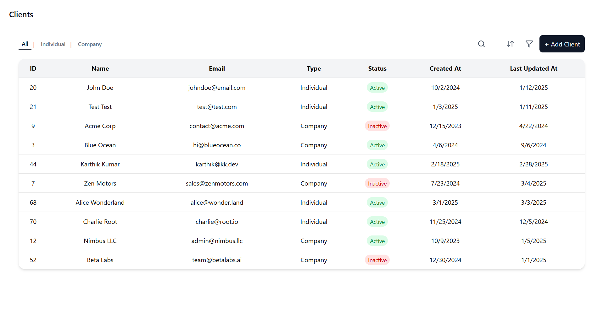

Client Table Management System

A React-based interactive dashboard for managing client data efficiently. The app provides sorting, searching, filtering, and client management features with a clean, responsive UI.

Features

Dynamic Sorting: Sort clients by multiple fields with visual indicators showing the number of active sort options.

Inline Search: Clickable search icon transforms into a search bar for quick lookups.

Type Filtering: Filter clients by type (All, Individual, Company) with selected option highlighted.

Client Status Indicators: Color-coded badges for active/inactive clients.

Add Client: Easily add new clients through a simple action button.

Responsive & Interactive UI: Smooth animations, hover effects, and badges for better usability.

Technologies Used

React for frontend development

TypeScript for type safety

Tailwind CSS for styling

Lucide Icons for consistent iconography

Installation

Clone the repository:

git clone https://github.com/your-username/client-table.git
cd client-table

Install dependencies:

npm install

Start the development server:

npm start

Open http://localhost:3000
 in your browser.

Usage

Use the search icon to quickly find clients by name or email.

Click sort to apply sorting rules; the badge shows how many sorts are active.

Use type filters to view all, individual, or company clients.

Click Add Client to simulate adding a new client.

License

This project is licensed under the MIT License.